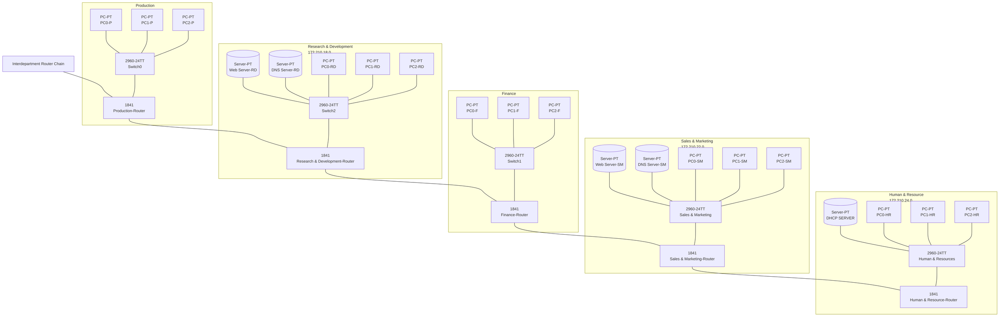

<p align="center">
	
</p>

<h1 align="center">organization-internal-network</h1>

<p align="center"><em>Static enterprise network simulation built in Cisco Packet Tracer, modeling five departmental LANs with routed core connectivity and shared DNS/DHCP/web services.</em></p>

<p align="center">
	
	
	
	
	
	
	
	
	
	
</p>


## Table of Contents

- [🚀 Project intro](#project-intro)
- [📁 Project structure](#project-structure)
- [⭐ Differentiators](#differentiators)
- [🔧 Features](#features)
	- [Network topology flow](#network-topology-flow)
	- [Department addressing plan](#department-addressing-plan)
- [🧰 Tech stack](#tech-stack)
- [⚙️ Install methods](#install-methods)
	- [📦 Cisco Packet Tracer](#cisco-packet-tracer)
- [🔐 Configuration](#configuration)
- [🗄️ Network layout](#network-layout)
- [📜 Available files](#available-files)
- [🚀 Usage notes](#usage-notes)
- [🤝 Contributing](#contributing)
- [📄 License](#license)

## 🚀 Project intro

`organization-internal-network` is a corporate network simulation built in
Cisco Packet Tracer. It models a centralized enterprise environment with five
departments connected through routed links and segmented access for internal
users and shared services.

The topology shown in the simulation includes:

- Production
- Research & Development
- Finance
- Sales & Marketing
- Human & Resource

Each department has its own access switch and end-user PCs, while selected
departments also connect to shared server resources such as web, DNS, and DHCP.

## 📁 Project structure

```text
organization-internal-network/
├── 5 departments.pkt
├── README.md
├── LICENSE
└── Setup.png
```

## ⭐ Differentiators

- Department-based segmentation instead of a flat single-LAN design
- Routed connectivity between departmental networks
- Shared infrastructure services modeled inside the topology
- Clear visual layout for demonstrating enterprise-style network design in
	Packet Tracer

## 🔧 Features

### Core features

| Feature | Status | Details |
| --- | --- | --- |
| Multi-department topology | ✅ Current | Five departmental networks are represented in the simulation |
| Router-based interconnection | ✅ Current | Each department is connected through a dedicated router path |
| Access switching | ✅ Current | Department PCs connect through access switches |
| Shared web service | ✅ Current | Web server nodes are included in the topology |
| Name resolution | ✅ Current | DNS server nodes are included in the topology |
| IP assignment service | ✅ Current | A DHCP server is included for dynamic address distribution |

### Network topology flow

The main simulation flow starts from the departmental PCs, passes through the
department switch, reaches the department router, and then connects across the
enterprise backbone to other segments and shared services.



The Mermaid flowchart summarizes the main path through the network, with the
top router chain and each department showing its switch, hosts, and shared
servers where present.

The Packet Tracer file is the source of truth for device placement, interface
addressing, and routing behavior.

### Department addressing plan

The simulation uses separate 172.210.x.0 network ranges for each department:

- Production: `172.210.16.0`
- Research & Development: `172.210.18.0`
- Finance: `172.210.20.0`
- Sales & Marketing: `172.210.22.0`
- Human & Resource: `172.210.24.0`

## 🧰 Tech stack

- Network simulator: Cisco Packet Tracer
- Topology elements: routers, switches, PCs, and server nodes
- Services: web, DNS, and DHCP
- Addressing: private IPv4 subnets in the `172.210.x.0` range

## ⚙️ Install methods

### 📦 Cisco Packet Tracer

Prerequisites:

- Cisco Packet Tracer installed on your machine

Open the simulation by loading the `5 departments.pkt` file in Packet Tracer.

Recommended workflow:

1. Open `5 departments.pkt` in Cisco Packet Tracer.
2. Inspect the topology in Realtime mode.
3. Switch to Simulation mode to observe packet flow between departments.
4. Review router, switch, and server configuration as needed.

## 🔐 Configuration

The project is self-contained inside the Packet Tracer file. No external
application secrets or environment variables are required.

If you want to extend the simulation, configure any additional services directly
inside Packet Tracer, such as:

- Router interface IP addresses
- Host IP addresses and default gateways
- DHCP pool settings
- DNS records
- Web server content

## 🗄️ Network layout

The topology contains five departmental areas, each with a dedicated router,
access switch, and end devices. Shared service nodes are attached where needed
for internal application access and network services.

Observed devices in the simulation include:

- 1841 routers for departmental routing
- 2950-24TT access switches
- PC-PT clients in each department
- Server-PT nodes for web, DNS, and DHCP services

## 📜 Available files

- `5 departments.pkt` — Cisco Packet Tracer topology file
- `Setup.png` — screenshot of the completed network layout
- `LICENSE` — project license

## 🚀 Usage notes

- This project is meant to be opened and explored in Cisco Packet Tracer.
- The screenshot in `Setup.png` provides a quick visual reference for the
	department layout.
- The Packet Tracer file can be used as a portfolio sample for enterprise
	network design, routing, and service segmentation demonstrations.

## 🤝 Contributing

- Fork the repository and keep changes focused on the network simulation.
- Document any addressing, routing, or service changes you make in the README.
- Avoid adding credentials or other sensitive values to the topology or docs.

## 📄 License

This project is licensed under the MIT License. See the `LICENSE` file for
details.
